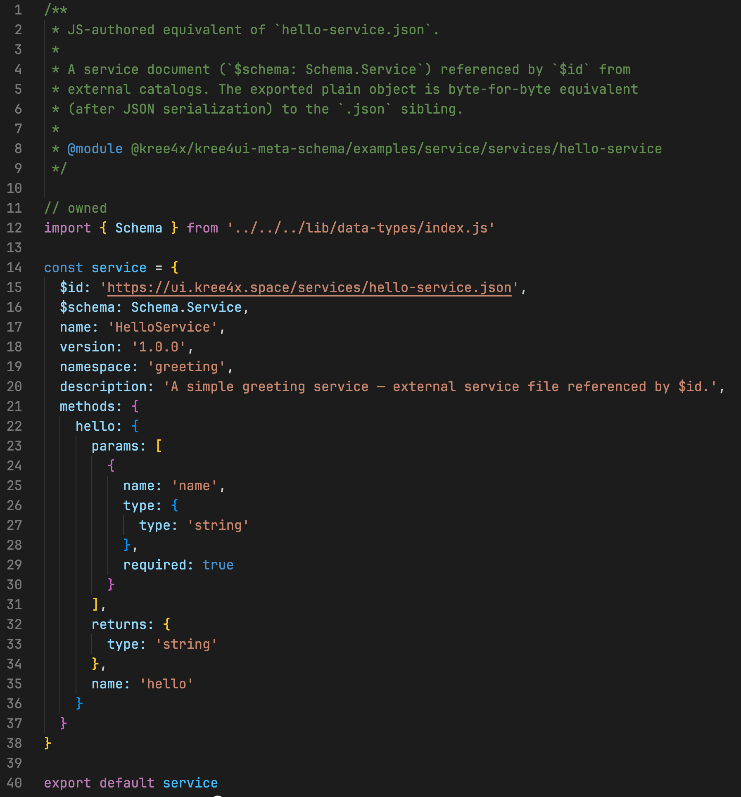

# 前言3：AI持有契约，Schema In AI，Not Service

> Created By [RV](mailto:rodney.vin@gmail.com), and licensed with Creative Commons "[CC BY-NC-ND 4.0](https://creativecommons.org/licenses/by-nc-nd/4.0/)"

**来自《面向AI Programming的软件工程范式》**

这一章节，其实是理论书***《[面向AI Programming的软件工程范式](https://zhuanlan.zhihu.com/p/2028183632976585299)》***的一篇杂言。

虽是杂言，却完整解释了为什么要在服务层完全抛弃Schema，为什么要选择非编译型的动态语言。

快速扫一遍，我们更容易放下强类型、伪强类型、静态类型等面向人类程序员的执念。

Schema在AI，类型，既可编码时由AI生成校验，也可运行时由AI动态注入。

以下，是正文。


*########假装是分割线########*

很多事情，在其起始，驱动我们起而行之的，往往只是一种直觉，一种信念。

看到一个可行、可信的目标，保证其不会沦为空谈，能将其落实在地，只有一种力量：**要相信，相信的力量。**

**“No Schema”易**

最早，在[面向AI Programming的服务调用](https://zhuanlan.zhihu.com/p/2027763667572208559)中，提出“**No Schema: Schema In AI, Not Service**”时，这仅仅是一种信念。相信其可行，相信其是“**面向AI Programming**”，相信其会为AI Coding带来极大的便利。

要实现No Schema，从RPC架构中拆掉Schema，保证Not In Service，不是难事。

通过[KreeX-RPC:  重构面向AI Programming服务调用范式](https://zhuanlan.zhihu.com/p/2028042363268776710)，讲述理论的同时，也完成了Kree4JS整个框架的创建：

“No Schema、异构通信网格、Serverless对等服务、传输与服务分离、透明RPC本地-远程语法一致、单调用粒度按需全链路跟踪、原生服务治理、Select-Reduce策略的服务集群……”

破立，只在数月之间。

**“Schema In AI”难**

Service层没有Schema，可以。

但是，整个体系，在其架构中，不可能没有Schema，所谓：没有规矩，不成方圆。

不论是“杀人者死，伤人及盗抵罪”式的约法三章，还是现代洋洋洒洒的严密严谨的法典，规矩的形式会变，但是“要有规矩”，这个本质不会变。

从Service层拆掉Schema，只是因为Service没必要持有Schema，AI持有Schema会更好。

Schema不会消失，只会形式变化，位置转移。

但，AI怎样持有，以何种形式、何种格式持有Schema，则是一个令人头痛的难题。

不过，虽然难，还是有优雅解的。

### 一. AI Native：在AI层定义Schema，在AI层持有Schema

从0到1，是破冰开路之旅，这总是最难的。

在没有现实可见、物理存在的证据之前，没人愿意在一个Idea上投入资源，除了迷之自信者，还有先行者。

以何种形式实现“Schema In AI”这个难题，其火花式的创意，来自A2UI的“UI Component Catalog”。

这个问题上，我，不是先行者，只是迷之自信者。

相信，被Inspired，然后借其道，用其意。

A2UI，将AI可用的UI组件编目，为AI生成UI划定明确的可用组件清单，这是UI Schema。

这是，“道”。止步于“UI Component Catalog”，过于可惜了。

一个APP，有组件、有布局、有样式、有服务、有数据。

同一个“道”，泛化到不同的范围即可。

然后，我们得到了**DataModel Catalog + Service Catalog**，这就是“Schema In AI”，这就是AI持有，约束AI，同时钳制了所有Service的唯一契约。

**AI Native**是指，整个体系脱离了AI则会坍塌和崩溃。

**开发期**，编制Schema，为Service和DataModel编目，这是一个人类主导 + AI辅助的过程。

意图、创意，来自人类，繁琐的实现，AI来编写，人类review修正。

一份Schema，由AI进行多语言适配，由AI实现多服务框架适配。

**运行期**，如何根据Schema校验服务调用，有两种方法：

- AI Coding时，根据Schema在服务内部注入校验代码。

- 服务框架提供动态AOP拦截机制，运行时AI Agent根据Schema动态注入拦截代码。

无论如何，脱离AI提供的智能化、自动化能力后，Schema的编制、动态校验、动态维护、动态分发机制都会崩溃。

不是人类没“**知识**”能力，是人类没**“数量、动态匹配**”能力。

### 二. Schema散在Service，实质是无Schema

当Schema只存在集中于中央的一份时，才是“真正的真相只有一个”。

这个道理很简单：各处封建，那是春秋战国；车同轨，书同文，才是一个大一统的帝国。

允许每个服务提供者，自下而上，定义自己的服务Schema，最终的结局则是“**人人都有，人人都无**”。

局部的有序，最终，带来全局的无序。

当Schema散在Service中时，每个Service的技术方案不同、schema格式不同、同类型多语义、同语义多类型……

对于身处中央的AI来讲：

- Coding时，要逐接口学习，逐schema理解，逐Service特异处理，麻烦无穷。
- 运行时，Service版本演进，Schema与实现脱节，动态漂移，惊喜处处惊心。

不论是人工编程，还是AI编程，最不需要的就是“平权”。放弃集中式的Schema编制与编目，是自取其乱。

Schema散落在Service，则是事实上的：

任一Service都有自身Schema，任一Service都无全局Schema，居中调度者全无Schema。

何必。

### 三. Schema Catalog：为AI编制同一的Schema定义目录

**集中式的Schema Hub不解决本质问题**

提供一个集中式的Schema Hub，允许各个Service自下而上定义自己的Schema，然后向Schema Hub注册，从而实现某种对Schema的集中管理，这不是我们的期望中的解决方案，它也解决不了任何的实质问题。

只要是“自下而上”，它就**不是**一种适合AI编程的解决方法。

**自上而下，才既是短期的霸道，也是长久的王道。**

编制Schema，使用Schema约束AI的代码生成，使用Schema定义服务间的通信契约，使用Schema动态校验服务调用，使用Schema定义AI Agent与AI Agent的通信契约。

Schema本身才是真相，而Service实现，则是转身即可能消失、随时重生刷新、临时动态的产物。

#### 探索期，理清意图，以Service Catalog订立契约

Schema应该是在“**探索期**”被制定的，Schema本身就是探索期的可见成果之一。

一个工程、一个功能模块、一个feature开始之初，我们往往并不能清晰地看到它落地的形式是什么。

个人，我的习惯是，只讲意图，只讲“Intents”。

我的MonoRepo下，一般有一个Intents目录，用来存放各种Intent碎片。

有了想法，不归类、不分层，只要求AI立即记录，并综合分析已有的各个Intent，是否重复、是否交叠、是否冲突。

然后，要求AI针对Intent，给出设计草案，按照预置的C4规则，进行逐层拆分、细化。

C4的L4层，实际所形成，就是数据模型代码、类层次划分、API方法签名定义。

剩下的事情，则简单多了。

定下Service Catalog的Schema，要求AI，基于C4的L4代码层UML定义，转写出Service Catalog实例。

例如，`greeting.hello(someone:string):string`在ServiceCatalog中，长这个样子：



基于这个Schema：

- AI生成的调用代码签名，可被约束、可被校验
- 服务调用被AOP拦截后，实际调用参数、返回值可被校验

Kree4X RPC + kree4UI配合使用，从理论到实现，好像没遇到什么不可逾越的障碍。

整个过程，唯一不可或缺的是AI。

没有AI的辅助，每一步都要人来细致、严谨、繁琐地操作，这基本是一个理论可行，而实际不可能的任务。

#### 开发期，基于Service Schema收敛AI生成代码的边界

编制了Service Catalog后，自然就为AI Coding时划定了明确的边界。

在[为AI划定边界：编制Catalog白名单，UI Component、AI Design、Service、DataModel](https://zhuanlan.zhihu.com/p/2066180433558214201)中，我们展开讨论过这个问题。

此处可以一笔带过了。

简单地提一下：

- 生成式UI中，Service Catalog划定了AI生成的UI Component实例中，各个组件可调用的Server端服务的白名单
- AI Coding中，Service Catalog提供AI可调用的各种Service的白名单边界，以及调用时详细的方法签名信息，方法功能说明。

而获得这一切能力，付出不过是：

- 编制提示词，指导AI方法论是什么
- 提供校验器，校验AI的输出是否违反了Schema约束
- Review时，要求AI遵循Schema约束，检查上一个Agent的输出。

#### 运行时，使用Service Schema强制校验服务调用

运行时，使用Service Schema校验服务调用是否违例，实际很简单。

前边提过，存在两种流派。

**AI Coding时，根据Schema在服务内部注入校验代码。**

这个属于力大砖飞的解法，Coding时，在服务、方法的入口处，写入Schema校验代码。

Raw代码，根据schema信息，根据语言不同，编制不同的校验代码。

```javascript
function hello(someone) {
  if (typeof someone !== 'string') {
    throw new Error()
  }
  ……
}
```

Schema修订一次，涉及的源码修改，漫山遍野。

人类做，既繁琐，又容易出错。

此种场景，则是AI所擅长的小粒度、批量、短程任务，由AI处理，又快又好。

力大了，砖确实能飞的。

**AOP拦截机制，注入拦截代码，根据Schema动态校验**

各种主流的服务框架，基本都有AOP式的拦截器、或者中间件机制的，允许按照一定的规则拦截特定服务，执行特定的业务逻辑。

eg. 常见的登录校验、令牌检查、权限检查……

Schema是一种规则，使用AOP拦截注入检查具体的服务调用，这是一种技巧式的解法。

以Kreejs的拦截器体系为例：

```javascript
// 初始化CatalogManager
const catalogManager = CatalogManager.addService('./kree4ui-demo-service-catalog.json')

// Kree4js服务拦截器
class ServiceInterceptor {
  /**  
  * 调用后拦截，校验返回值
  */
  afterCall (ctx, result, cluster, methodName, params, options) {
    const { name: serviceName } = cluster
    if (!result.ok) {
      return
    }
    // 获取校验器
    const validator = catalogManager.service(serviceName)
    // 校验方法调用返回值
    const validateResult = validator.validateReturn(methodName, result.value)
    if (!validateResult.ok) { // 校验失败，返回错误
      return { done: true, error: validateResult.error}
    }
  }

  /**
  * 调用前拦截，校验入参
  */
  beforeCall (ctx, cluster, methodName, params, options) {
    const { name: serviceName } = cluster
    // 获取校验器
    const validator = catalogManager.service(serviceName)
    // 校验方法调用入参
    const validateResult = validator.validateCall(methodName, params)
    if (!validateResult.ok) { // 校验失败，返回错误
      return { done: true, error: validateResult.error}
    }
  }
}
```

**如何选择**

何时选择力大砖飞的Raw校验，何时选择基于规则的AOP式校验，其实并没有所谓的“**必须怎样**”的原则。

传统的人工时代，我们对于修改源代码，有一种近乎于“禁忌式”的思维定式：大量改代码，是不对的。

而在AI时代，最终代码会沦为一种廉价的临时中间级产物(努力中……)，AI Coding，何必在意？

如果，你的系统规模庞大，或者演变迅速、Schema不稳定、代码也不稳定，基于AOP式的规则动态注入，则会提供更好的开发体验，和运维便利。

最差，最差，AOP式拦截，可以省Token，不是么？😊

#### AI-2-AI，使用Service Schema定义AI Agents通信语言

AI时代，对于RPC式的服务，我有一种近乎偏执式的偏爱。

因为：RPC服务，自带语义。

名字就是力量！

方法名，就指示了自身存在的意图；参数名，就指明了参数存在的目的。

配合Service Schema，提供类型约束，签名约束，及针对AI的Instruction信息描述，它天然对AI友好。

在此方面，HTTP几乎处处都是反派。

使用Service Schema，订立A2A，Agent To Agent的通信语义，与我而言，则是一种最自然的选择。

“**Agent To Agent需要通信语义契约**”，这是本质需求。

而如何实现，则是个人偏好了。

我的选择，是基于RPC的Service Schema声明。

严格讲是基于Kree4X RPC的Service Schema。

- Kree4X服务与通信分离。一个服务实现，并不关心底层的通信机制。
- Kree4X通信层异构协议组网，HTTP、TCP、UDP、WebSocket……，各种节点可以无缝组网，这大幅消解了HTTP所谓的“普适性”
- Kree4X节点动态发现，节点间动态协商，动态直连
- kree4原生支持服务集群，Select-Reduce模型，动态选择服务节点，动态合并处理结果

最重要的是，**架构统一**。

不论是Web客户端与服务端、微服务节点与微服务节点间、还是客户端与AI、服务端与AI、AI与AI间，所有参与者都使用统一、简单的透明RPC语义式通信。

挺好。

### 四. Schema In AI，强类型语言是累赘

工程上，我是实用主义者。

什么场景，适合什么语言，就选择什么语言。试图金手指式的一种语言走天下，这是自找麻烦。

而AI时代，在大规模的AI Coding后，一个强烈的断言式的感觉越来越觉得理所当然：

**“非必要，不要强类型。”**

某些场景，不得不为之，那就只能用之。

有任何可以替代的可能，就果断把强类型语言扔到一边，有Javascript，有Python可用，就不要碰任何真强类型、伪强类型语言。

最讨厌“引战”，此处也无任何引战之意。

一家之言，不喜勿扰。

#### AI时代，变是唯一的不变，动态性第一

源代码，最终会成为没人多看一眼的黑盒，最多是灰盒。

[Rule 1: 软件成为灰盒，甚至黑盒](https://zhuanlan.zhihu.com/p/2028892605161697301)，我们旗帜鲜明地表达过这个观点。

意图是根本，Schema是契约，而代码则是派生，只是唯一真相的一种阶段性投影。

重要么？很重要。

真的重要么？其实不重要。因为，AI持有明确严格的Service Schema及详细的C4级设计分解时，我们可以拿Token换。

源代码，很廉价。

LLM能力够强，人类或者审查Agent的Review能力跟得上的话，它的质量也能很可靠。

所以，如果一个场景下，多种语言都可以满足要求的情况下，AI优先。

AI First，是一种态度，整个体系给AI让路，AI怎么便利，我们就怎么做事。

#### AI生成式情景下，静态编译式语言天然处于劣势

动态生成的场景下，任何静态编译式的语言，其实都不适合AI处理。

“动态生成”，是一种生产环境状态。此时“静态编译”才可交付，意味着需要把开发期的基础设施带入到生产环境，这一点极其荒谬。

太重、过重，低效，这一点上，应该是基本的共识。

何必呢，又不是没有别的选择。

#### 强类型静态语法检查：阻止人类语法错误，对于AI得失已失衡

即便不是AI编程时期，个人也对类型体操深恶痛绝。

Javascript + JSDoc为IDE提供类型提示已足够，所以当Svelte 团队正式把 Svelte 核心代码库从 TypeScript 迁移到 JavaScript + JSDoc，我所能做的只有会心的一笑。

静态的类型检查，是一种针对人类编程的特异化设计。

对于AI，则是彼之蜜糖我之毒药。

强类型，最大的价值，在于人类编写源码时，IDE即可即时给出反馈，防止人类程序员各种低级的语法错误。

而在AI时代，这成为了一种时代的化石。类似于，智能手表时代的机械表，精致、精美的小众选择与艺术品，对大众来讲，被毫不犹豫地抛弃。

AI不需要强类型，AI需要的是Service Schema的语义提示。

AI编写代码，编码期需要的是语义。

调试运行期，AI不靠强类型兜底，靠的是运行时试错，靠的是完备的测试用例约束。

#### 强类型运行态类型检查：有用，但不够，Schema定义约束不仅是类型

回到现实，从交付的角度来讲，强类型既多余，又不够。

类型检查，与Service Schema机制重复。况且类似TS之类的伪强类型，在运行期毫无类型。

而Service Schema所能提供的语义式约束，例如最大值、最小值、取值空间、匹配模式、多参数校验规则，没有任何是强类型语言所能提供的。

既然开发期，人类不在编码，既然在运行态，还是要引入校验代码，那么，何苦来着？

使用前述的“**运行时，使用Service Schema强制校验服务调用**”，不香么？


**BTW：**

Kree4X RPC + Kree4UI结合使用后，涌现出各种奇奇怪怪，但是架构优美的能力。

越来越体会到《技术的本质》书中所言的“组合进化”的乐趣。😁
