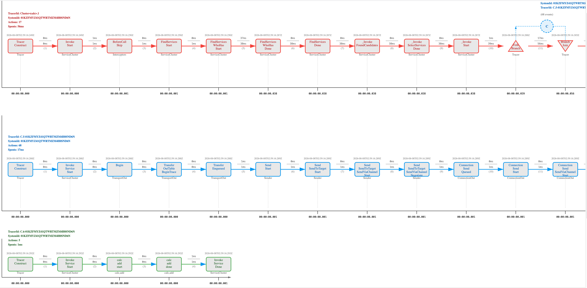
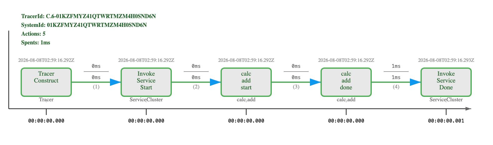

# Tracing：单次调用粒度的全栈调用及通信追踪

> Created By [RV](mailto:rodney.vin@gmail.com), and licensed with Creative Commons "[CC BY-NC-ND 4.0](https://creativecommons.org/licenses/by-nc-nd/4.0/)"

**目的与场景**

在这一章，讲解如何开启Tracing，追踪一次跨节点服务调用的完整时间线。

“时间线”，通过由各个TimeEvent、Action组成的完整的、跨节点、跨整个通信链路的多分支时间线，可以详尽的追踪服务调用的完整过程。

是为AI而设计，对于人类来讲，信息过载；对于AI来讲，很好。

### 一. 概念

**Tracing**

Kree4X的Tracing，以单次服务调用为粒度，自动追踪Caller与Callee之间的全栈调用及通信过程，形成完整的、包含主时间线、多分支时间线的完整全链路追踪信息。

追踪数据包含：服务发现、请求发送、响应接收等各阶段的时间戳和耗时。

详情参考：[追踪：KreeX Tracing](https://zhuanlan.zhihu.com/p/2036394167438415089)

**时间事件: Time-based Action Event**

一个时间事件，其实质是一次函数或对象方法调用中，某个时间节点的现场快照，它记录了现场某个切面的瞬时状态。

详见：[时间事件: Time-based Action Event](https://zhuanlan.zhihu.com/p/2037090603226361964)

**时间线：Timeline**

时间线Timeline，是指TimeEvent按照时间戳顺序排列、连接所形成的有向序列。

详见：[Tracing时间线：Timeline](https://zhuanlan.zhihu.com/p/2037124923194389383)

### 二. 开启Tracing

在下边的示例中，我们将：

- 手工开启服务存根的Tracing
- 发起服务调用
- 调用完毕获取服务存根最后一个Tracer
- 使用Tracer，将服务调用完整的时间线输出为svg

```javascript
import Kree4n from '@kree4js/kree4n'
import Trace from '@kree4js/tracing'
// 方法调用最后一个参数是动态注入的Context，携带了Tracer
callee.register('calc', {
  add (a, b, ctx) {
    // 获取 tracer，开启一个新的逻辑“phase”
    const tracer = ctx.tracer?.phase('calc.add')
    // 标记开始处理
    tracer?.trace(`Start Handling ${a} + ${b}`, '', 'calc.add.start', 'detail info')
    // 业务操作
    const result = a + b
    // 标记处理结束
    tracer?.trace(`Done Handling ${a} + ${b}`, '', 'calc.add.done', 'detail info')
    return result
  }
})

// 获取服务存根，开启tracing
const calc = caller.service('calc')
// 为服务存根后续调用开启Tracing
calc.traceEnabled = true

// 调用服务
const result = await calc.add(10, 20)

// 导出tracing时间线为SVG
const tracer = calc.lastTracer
tracer.output(new Trace.SvgFormatter(), new FileWriter('./tmp', '.svg'), Trace.OutputLevel.INFO)
```

**时间线输出**

输出的时间线，包含了完整的Caller端调用栈、通信栈、Callee端调用栈。

是一个多分支的，完整时间线结构。

完整的时间线svg，点击访问[调用的完整时间线](../assets/01-04-01.svg)

图太宽了，不适合在此完整显示，下图仅是全图局部。



**业务方法的时间线输出**

输出的svg中，包含了add方法内部的Tracing时间线。如下图：



### 三. 须强调的细节

**输出的svg是可以交互的**

鼠标移动到一个Action上，会显示一个Action的概要信息。

点击一个Action，会以此Action为中心自动对中，并显示Action详情。

点击一个分支时间线，会自动调整到分支时间线起始

……

**业务方法内部如何Tracing？**

注意calc.add(a,b,ctx)，最后一个ctx参数。

Callee端，方法被调用时，框架会自动注入一个Context参数。

使用ctx.tracer可以获取到Tracer对象，使用tracer api记录业务操作过程。

业务操作的Tracing，会被自动融合到整个完整的调用时间线中。

**默认全局关闭**

全局尺度，tracing默认是关闭的。

全局、全量Tracing，性能、资源消耗角度，都是不可承受之重。

**以服务存根单次调用为控制粒度**

服务存根手工traceEnabled = true后，后续调用会自动记录Tracing。

**没开启Tracing，调用出错时怎么记录？**

Kree4X內建“自动重试、自动Tracing”机制。

使用服务存根，开启重试策略，当调用远程服务失败时，会在最后一次重试时，自动Tracing。

中级篇，在“**重试策略**”章节，会完整讲解整个过程。

**Tracing时间线输出格式**

示例中，使用的是SvgFormatter，输出为svg可交互矢量图格式。

系统还內建有JsonFormatter、TextFormatter，可以输出为JSON、纯文本格式。

示例中，使用FileWriter，将时间线输出为文件。

系统还內建有ConsoleWriter，将时间线输出到控制台；LoggerWriter，将时间线输出到日志器logger。

### 四. 涉及到的API:

**开启Tracing traceEnabled**

在服务存根上设置 `traceEnabled = true`，该服务的所有后续调用都会被追踪。

```typescript
/**
 * Gets or sets the trace enabled flag.
 * When true, all subsequent calls on this service cluster will be traced.
 */
ServiceStub.traceEnabled: boolean
```

**获取最后一个Tracer lastTracer**

调用完成后，通过服务存根的 `lastTracer` 获取本次调用的Tracer对象。

```typescript
/**
 * Gets the tracer from the last service call.
 * Returns undefined if no call has been made or tracing was not enabled.
 */
ServiceStub.lastTracer: Tracer
```

**在服务实现中获取Tracer ctx.tracer**

服务方法的最后一个参数 `ctx` 包含 `tracer`，可通过 `tracer.phase()` 获取TracePhase。

```typescript
/**
 * In service implementation, the last parameter is context injected by the framework.
 * Use ctx.tracer to access the tracer for this call.
 */
ctx.tracer: Tracer
```

**创建TracePhase tracer.phase()**

创建一个TracePhase，提供tracing的逻辑分段。

```typescript
/**
 * Create a TracePhase to avoid tracer.trace(phase, ...)
 * @param {string} name - The phase name.
 * @returns {TracePhase} A trace phase instance.
 */
phase(name: string): TracePhase
```

**记录追踪事件 tracer.trace()**

在Tracer的主时间线上追加一个时间事件。

```typescript
/**
 * Append a Time-based Action Event into the tail of Tracer's main timeline.
 * @param {string} summary - The summary of the event.
 * @param {any} actor - The actor who performed the action.
 * @param {string} action - The action name.
 * @param {...any} args - Additional arguments related to the action.
 * @returns {TimeEvent} The created time event.
 */
phase.trace(summary: string, actor: any, action: string, ...args: any[]): TimeEvent
```

**输出Tracing时间线 tracer.output()**

将Tracer的时间线格式化并输出。

```typescript
/**
 * Output the tracer's timeline.
 * @param {Formatter} formatter - The formatter (SvgFormatter, JsonFormatter, TextFormatter).
 * @param {Writer} [writer] - The writer (FileWriter, ConsoleWriter, LoggerWriter).
 * @param {any} [level] - The output level (Trace.OutputLevel.INFO, etc.).
 * @returns {string|any} The formatted result.
 */
output(formatter: Formatter, writer?: Writer, level?: any): string | any
```

### 五. 可运行代码

完整示例代码，参见：[04-tracing.mjs](../examples/01-basic/04-tracing.mjs)
