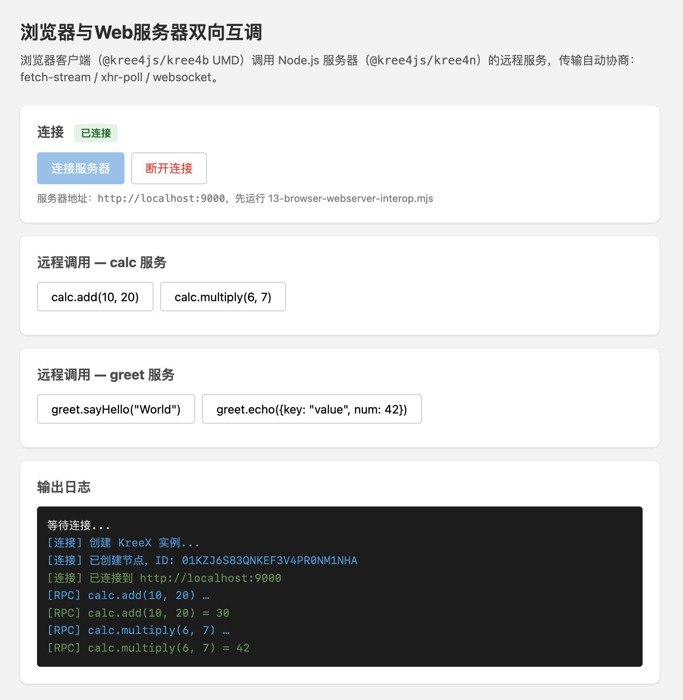

# 浏览器与Web服务器双向互调

> Created By [RV](mailto:rodney.vin@gmail.com), and licensed with Creative Commons "[CC BY-NC-ND 4.0](https://creativecommons.org/licenses/by-nc-nd/4.0/)"

**目的与场景**

在这一章，讲解**浏览器（Kree4B）与NodeJS Web服务器（Kree4N）**如何互联，实现双向RPC调用。

### 一. 概念

**1. Kree4B**

“@kree4js/kree4b”，是For Browser实现。

**2. Kree4N（Web服务器角色）**

使用http-listen：

- Listen模式监听 `http://` 端口，或者`https://`

**3. 浏览器信道**

http-listen提供三种受浏览器支持的信道，browser-attach会自动协商最佳信道：

| 信道 | 方式 | 特点 |
|------|------|------|
| `fetch` | 长连接HTTP POST流式响应 | 长连接、浏览器原生支持 |
| `xhr` | 短连接HTTP POST轮询 | 短连接、兼容性最好 |
| `websocket` | WebSocket升级 | 全双工、延迟最低 |

### 二. 示例代码

在下边的示例中，我们将：

- Node服务器监听9000端口，注册calc、greet服务
- 浏览器打开 `http://localhost:9000/client.html`，作为Kree4B客户端连接
- 浏览器调用服务器的calc/greet服务（浏览器 → 服务器）

**服务端（Node.js）**

```javascript
import Kree4n from '@kree4js/kree4n'

const node = Kree4n.create('browser-server', 'Kree4B Example RPC Server', { port: 9000 })
node.register('calc', {
  add (a, b) { return a + b },
  multiply (a, b) { return a * b }
})
node.register('greet', {
  sayHello (name) { return `Hello, ${name}! (from server)` },
  echo (data) { return data }
})
node.listen('http://0.0.0.0:9000')
await node.start()
```

**客户端（浏览器html中的javascript）**

```html
<!-- 引入kree4b UMD（由服务端/kree4b.js提供） -->
<script src="/kree4b.js"></script>
<script>
  // 创建浏览器版节点
  const kreex = Kree4B.create('browserClient', 'Browser Client')

  // 连接服务器，传输自动协商（fetch-stream/xhr-poll/websocket）
  kreex.attach('http://localhost:9000')
  await kreex.start()

  // 调用服务器上的calc服务
  const calc = kreex.service('calc')
  const result = await calc.add(10, 20)   // 30
</script>
```

**客户端示例UI**



### 三. 须强调的细节

**1. Kree4B是纯客户端**

浏览器无法Listen端口，浏览器节点不提供任何Listen能力。

**2. 静态文件与RPC共用端口**

借助http-listen的 `httpServer` 选项，可以把自定义静态文件路由与Kree4X的RPC路由放在同一个HTTP服务器上：

```javascript
const httpServer = createServer()
httpServer.on('request', (req, res) => { /* 静态文件 */ })

node.listen('http://0.0.0.0:9000', { httpServer })
```

**3. UMD构建**

kree4b的npm包自带UMD构建产物（`dist/umd/prod/index.js`），`<script>` 直接可用，无需自行打包：

```bash
npm install @kree4js/kree4b
```

`server.mjs` 会自动从已安装的包中定位UMD文件，以 `/kree4b.js` 提供给浏览器加载。

浏览器加载`/kree4b.js` 后，暴露全局变量 `Kree4B`。

**4. Nginx反向代理部署（生产环境）**

本地示例使用NodeJS创建HTTP Server，同时开放静态文件与Kree4N服务。

实际产品环境，一般使用 **Nginx**类软件提供静态文件服务、API网关反向代理：

- Nginx提供静态文件（client.html、kree4b.js等）
- Nginx将对kree4x服务的调用**转发**到后端kree4x节点
- 浏览器attach的地址是Nginx的地址（如 `https://ng.example.com`）

kree4x暴露的端点由http-listen在 `/kreex/` 前缀下注册：

| 端点 | 方法 | 用途 |
|------|------|------|
| `/kreex/stream` | POST | fetch-stream双向流式信道 |
| `/kreex/xhr-poll` | POST（含query） | XHR长轮询信道 |
| `/kreex/xhr-receive` | POST | XHR短连接信道 |
| `/kreex/ws` | GET（Upgrade: websocket） | WebSocket升级 |
| 以上任一 | HEAD | 探测后端是否为kree4x节点（attach时自检） |
| 以上任一 | OPTIONS | CORS预检（返回204 + `Access-Control-Allow-Origin`） |

### 四. 涉及到的API:

**1. 创建浏览器节点**

```javascript
Kree4B.create(name: string, description: string, options?: {
  worker?: { threshold: number, workerCount: number }
}): KreeX
```

**2. 浏览器连接**

```javascript
kreex.attach(url: string): this
```

### 五. 可运行代码

完整示例代码，参见：

- <a href="../examples/01-basic/14-browser-webserver-interop/server.mjs" target="_blank">14-browser-webserver-interop/server.mjs</a>
- <a href="../examples/01-basic/14-browser-webserver-interop/client.html" target="_blank">14-browser-webserver-interop/client.html</a>